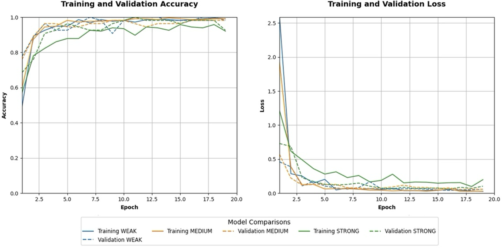

# **Understanding Architectural Style Through Deep Learning**

## ***Introduction***
In the exploration of Western architectural history, understanding and classifying architectural styles has traditionally been the domain of experts, requiring extensive domain knowledge and field studies(Sun et al., 2022). The challenge of accurately categorizing such styles is compounded by the need to analyse a vast array of visual data across diTerent geographical locations.

Recently, advancements in deep learning have established the potential for machines to eTectively deal with ton of visual data at one time and analyse various characteristics of built environment, so that researchers could address the challenge before. Considerable research has been dedicated to unpacking architectural and urban studies with machine understanding.

This project aims to builds an application to employ a deep learning model to classify Western architectural styles using real-world images sourced from online search engines. This method not only simplifies the task of architectural style classification but also enriches our understanding of style evolution through detailed visual analysis.

## ***Research Question***
How eTectively can a deep learning model, trained on images from the internet, classify Western architectural styles and identify key visual elements that define these styles?

## ***Application Overview***
**Task Definition**

From previous studies on style evolution, we can find that there are many particularly similar styles, which usually only modify the material, shape, or structure of parts of the building. This shows that it is quite challenging to conduct an exhaustive classification study of each subdivision style. Therefore, this project aims to sort out and integrate the many branches of these evolutions in detail, and finally select three highly diTerentiated architectural styles to build a classification model.

    

 

First, the most numerous and far-reaching ones are a series of derived styles based on ancient Greek and Roman architecture. This project positions this style as a typical category of research - classical architectural style. In addition, Gothic style and Byzantine style, as two styles with significant individual characteristics formed in the development of Western architectural styles, were also selected as typical categories for this study. It can be said that these three styles are the three with the most prominent visual characteristics in the development process of Western architectural art.

    

**Application Framework**

The application implementation framework this time is divided into two parts: hardware and software. The software part mainly trains and builds the model based on the TensorFlow framework and uses TensorFlow lite to compress and simplify the model for mobile deployment to realize the encapsulation of the TinyML model.

The hardware part mainly uses Flutter to input image data. Users can choose to use a camera or photo album for image recognition, and the result will be displayed on the screen.

    

## ***Data***

**Data Collection**

The training data for this project were sourced entirely from various online image search engines, including Google Images, Baidu Images, and Bing Images. I utilized Python scripts with Selenium automation to perform batch downloads of these images. A total of 431 images were downloaded.

**Data Cleaning**

The search engines contained a large number of irrelevant images, such as unrealistic hand-drawn pictures and images focused only on small details of buildings. Therefore, the project involved a cleaning process to remove images that could not provide positive learning outcomes for the model. After this cleaning process, 269 images remained.

**Data Organization**

*Cloud Storage for Training Data:*  As the training and deployment of this model primarily rely on the Google Colab platform, the project opted to store the training data in Google Drive for centralized management. This setup allows for easy access to the data directly from Colab by mounting Google Drive.

    

 

*Standardization of Naming and Format:*  The images downloaded from search engines had varied formats and naming conventions, which could potentially impact the model training process. To address this, I wrote Python scripts to convert all images to JPEG format and rename them in the format “CategoryLabel_ImageIndex”.

    

 

*Splitting Training and Validation Sets:*  To facilitate the creation of training and validation sets during the model training process, the original data was pre-divided into 80% for training and 20% for validation. This preprocessing step was not stored separately on Google Drive. During the experimental phase of the model, different dataset ratios were tested, hence, the data division task was integrated into the model training code prior to experimentation.

    

 

## **Model and Experiments**

In the preliminary phase of model experimentation, an in-depth exploration of potential model architectures was conducted. Utilizing the list provided by TensorFlow's Keras Applications API, the focus was placed on selecting models apt for mobile deployment, emphasizing model size, inference latency, and accuracy.

    

 

The scatter plot of model information using data from the Keras API suggested that ideal models for mobile deep learning should trend towards the upper left corner, indicating high accuracy coupled with a smaller footprint.

**Test on Model Framework**

Considering these features, MobileNetV2, EfficientNetB1, DenseNet121, ResNet50V2, and VGG16 have been identified for subsequent testing and potential adoption. The first three models are noted not only for their exemplary performance but also for their lightweight characteristics, which are advantageous for mobile deployment. Conversely, the latter two are recognized as classic works in the field of deep learning, offering a robust benchmark for evaluating model efficacy.

This project used basic settings at first to test different framework. Epoch is set to 20, Batch Size is set to 30, and Optimizer is set to Adam. Through the following line chart, we can find that the performance of the EfficientNet framework in this project is particularly unstable, among which DenseNet121 performs better and converges more stably. Therefore, subsequent tests are conducted based on DenseNet121.

    

 

**Test on Optimizers**

Next, model testing mainly focuses on the selection of optimizers. The model was tested based on common optimizers such as Adam, SGD, AdaMax, AdaGrad and RMS.

In the comparison of optimizer tests, it was found that for the task of this project, the Adam class optimizer performed better. The RMS optimizer and SGD optimizer were unable to achieve stable convergence, and there would be obvious fluctuations in the middle and late stages of training. Therefore, the final optimizer selected AdaMax.

    

 

**Test on Learning Rate**

Then the learning rate of the optimizer was tested with different values. By consulting the information, we learned that the default learning rate of AdaMax is 0.002, so the test value was set around this benchmark. They are 0.002, 0.001, 0.0005, 0.005, 0.01 respectively. 

    

 

After testing, it can be found that 0.005 and 0.001 are close to the default learning rate in terms of model performance, and the remaining learning rate convergence process is relatively volatile or the convergence speed is slow. In the end, based on the requirements of this project on the model convergence speed, we chose to maintain the default learning rate for subsequent tests.

**Test on Data Augmentation Strengths**

At this point, we have basically determined the test of the model itself and obtained relatively stable model training parameters. Next, test the data and training batches. Since the amount of data acquired in this project is limited, it has high requirements for data enhancement to obtain relatively high model accuracy with a relatively small sample size. Next, different data augmentation strengths are tested.

    

 

After observation, it can be found that the model performance of the medium-intensity data enhancement degree is the most balanced. While maintaining the uniform performance of the training and validation sets, it provides enough data diversity to improve the model generalization ability.

    

 

**Test on Batch Size and Epoch**

Thereafter, final adjustments are made to the model's training parameters to determine the model for deployment. Design tests with different batch sizes and different epochs.

    

 

Through observation, it can be found that when the batch size is 30 and 60, the model shows better performance on the training and verification sets, the training loss and accuracy increase steadily, and the verification loss and accuracy are also relatively stable. Therefore, on this basis, the two batch sizes were tested for 50 epoch each to observe its performance in the long-term training process.

    

 

After the final test, judging from the model training performance, when the batch size was 60, there were relatively large fluctuations during the long training process, while when the batch size was 30, the performance was excellent and stable in the 50epoch model test. This model was finally selected as a file for subsequent application deployment, and its training and verification accuracy rates were 99.53% and 98.15% respectively.

## **Model Deployment**

After obtaining the model file, convert the TensorFlow Lite model in colab, and then deploy the model with the help of the TensorFlow Lite package in flutter. The final application interface consists of an input page and a result page. Users can choose to use album pictures or direct camera shooting for image prediction.After obtaining the model file, convert the TensorFlow Lite model in colab, and then deploy the model with the help of the TensorFlow Lite package in flutter. The final application interface consists of an input page and a result page. Users can choose to use album pictures or direct camera shooting for image prediction.